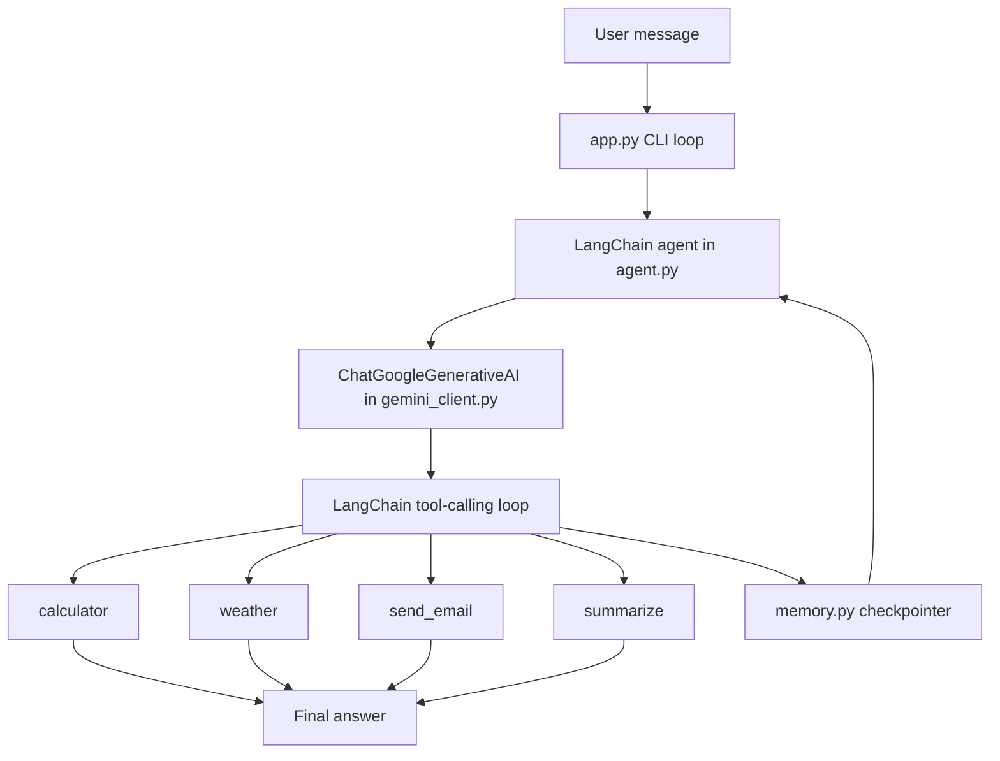

# AI Utility Agent

AI Utility Agent is a small command-line assistant that preserves the original behavior of the project, but now uses LangChain internally for model access, prompt handling, tool registration, and session memory.

## Why LangChain Was Added

The original version used direct Gemini SDK calls, manual prompt strings, manual JSON parsing, and manual `if`/`elif` routing. LangChain replaces that plumbing with standard abstractions so the code is easier to extend, safer to maintain, and closer to the current LangChain ecosystem.

## What The App Does

The app still supports the same features:

- Calculator tool
- Weather tool, mocked
- Email tool, mocked
- Summarizer
- Gemini-powered responses

The difference is internal: LangChain now decides which tool to call and executes it through the agent graph.

## Project Structure

- `app.py` - CLI entry point and chat loop
- `agent.py` - LangChain agent wiring and response extraction
- `gemini_client.py` - Gemini chat model setup
- `prompts.py` - reusable PromptTemplate-based system prompt
- `tools.py` - LangChain tools
- `memory.py` - in-memory conversation checkpointing for the current session
- `requirements.txt` - Python dependencies

## Requirements

- Python 3.10 or newer
- A Gemini API key in `.env`
- Internet access for Gemini API calls

## Install Dependencies

1. Create and activate a virtual environment.

```bash
python -m venv venv
venv\Scripts\activate
```

2. Install the project dependencies.

```bash
pip install -r requirements.txt
```

3. Add your Gemini key to `.env`.

```env
GEMINI_API_KEY=your_api_key_here
```

## Run The App

```bash
python app.py
```

Type a message and press Enter. Type `exit` to stop the session.

## Run The Streamlit UI

```bash
streamlit run streamlit_app.py
```

This opens a browser-based chat interface that uses the same LangChain agent and the same tools as the CLI.

## Architecture Difference

### Old Flow

User input -> Gemini SDK -> JSON string -> Python branching -> tool function -> return value

### New Flow

User input -> LangChain agent -> tool selection -> tool execution -> final response

## Block Diagram



## How The Code Flows

1. `app.py` reads a user message from the terminal.
2. `run_agent()` in `agent.py` sends the message to the compiled LangChain agent.
3. `gemini_client.py` creates the `ChatGoogleGenerativeAI` model from `.env`.
4. `prompts.py` renders a reusable system prompt with `PromptTemplate`.
5. LangChain chooses one of the registered tools from `tools.py` or answers directly.
6. `memory.py` keeps the current terminal session history in memory through a checkpointer.
7. `agent.py` extracts the final AI message and returns it to the CLI.

## Tool Mapping

- `calculator(expression)` evaluates a math expression and returns the result as text.
- `weather(city)` returns a mock weather response for the requested city.
- `send_email(receiver, message)` returns a mock email confirmation.
- `summarize(text)` shortens long text to the first 20 words.

## Implementation Notes

- The manual JSON router has been removed.
- LangChain tool registration now replaces the custom tool registry.
- Conversation memory uses `InMemorySaver`, which is appropriate for a current-session CLI demo.
- `calculator()` still uses `eval()` internally to preserve the old behavior, but the globals are restricted.
- The app now fails fast if `GEMINI_API_KEY` is missing.

## Files To Review

- [agent.py](agent.py)
- [gemini_client.py](gemini_client.py)
- [prompts.py](prompts.py)
- [tools.py](tools.py)
- [memory.py](memory.py)
- [streamlit_app.py](streamlit_app.py)
