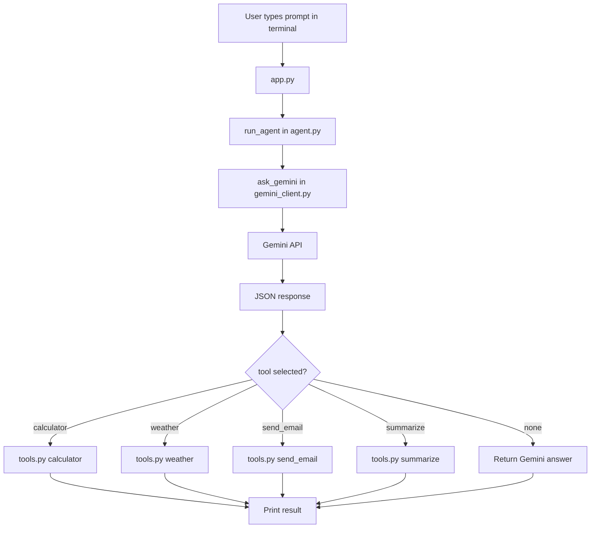

# AI Utility Agent

This project is a small command-line AI agent that routes user requests to Gemini and then dispatches the request to a utility tool when needed.

## What It Does

The app accepts a text prompt from the terminal and decides whether to:

- answer directly with Gemini
- calculate a math expression
- return a weather-style response
- simulate sending an email
- summarize long text

## Project Structure

- `app.py` - command-line entry point
- `agent.py` - decides which tool to call
- `gemini_client.py` - sends the user prompt to Gemini
- `prompts.py` - system prompt that tells Gemini to return JSON only
- `tools.py` - local utility functions used by the agent
- `requirements.txt` - Python dependencies

## Requirements

- Python 3.10 or newer recommended
- A valid Gemini API key
- Internet access for Gemini API calls

## Installation

1. Create and activate a virtual environment.

```bash
python -m venv venv
venv\Scripts\activate
```

2. Install dependencies.

```bash
pip install -r requirements.txt
```

3. Create a `.env` file in the project root and add your Gemini key.

```env
GEMINI_API_KEY=your_api_key_here
```

## How To Run

Start the app from the project root:

```bash
python app.py
```

Type a prompt and press Enter. Type `exit` to stop the program.

## Code Flow

1. `app.py` waits for user input in a loop.
2. It passes the input to `run_agent()` in `agent.py`.
3. `agent.py` sends the prompt to `ask_gemini()` in `gemini_client.py`.
4. Gemini is instructed by `SYSTEM_PROMPT` in `prompts.py` to return JSON only.
5. `agent.py` parses the JSON response and checks the `tool` field.
6. If a tool is requested, the matching function in `tools.py` is executed.
7. If no tool is needed, the direct Gemini answer is returned.

## Block Diagram



## Tool Behavior

- `calculator(expression)` evaluates a math expression and returns the result as text.
- `weather(city)` returns a fixed sample weather response.
- `send_email(receiver, message)` returns a simulated email confirmation.
- `summarize(text)` returns the first 20 words if the text is long.

## Notes

- The agent expects Gemini to return valid JSON. If the response is malformed, `json.loads()` will fail.
- `calculator()` uses Python `eval()`, so it should only be used with trusted input.
- `gemini_client.py` currently defines `ask_gemini()` twice; the second definition is the one that is used.

## Suggested Next Improvements

- Add JSON error handling around Gemini responses.
- Replace `eval()` with a safer math parser.
- Turn the CLI into a small web app or Streamlit app if you want a UI.
